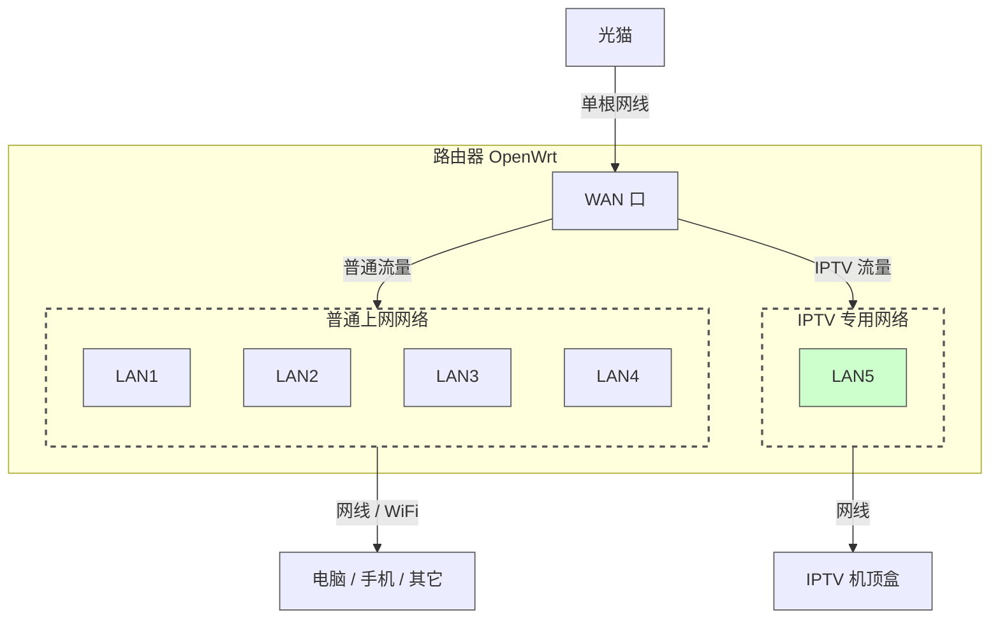
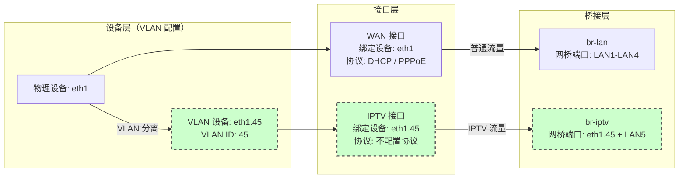

因为装修时，从弱电箱到客厅只预留了一根网线，此前电信师傅的方案是把网线的 8 芯分成两份，每 4 芯做成一个水晶头，一个接机顶盒，一个接路由器，这样就实现了一根网线既能上网，也能使用 IPTV。但由于 4 芯网线最多只能跑满 100M 的宽带，而现在大部分家庭宽带都是 300M 到 1000M，所以为了充分利用带宽，就需要使用单线复用技术。

单线复用是一种网络技术，旨在通过一根物理网线同时传输多种网络业务。通过这种技术，可以在不增加布线的情况下，实现普通上网数据和 IPTV 信号的传输，避免重新布线的麻烦。实现单线复用通常依赖 VLAN（虚拟局域网）技术，通过在网络设备上对数据流量进行标记和分离，达到不同网络业务共用一根网线的目的。

下面我就来介绍如何使用 OpenWrt 路由器，通过合理规划 LAN 口（普通上网区和 IPTV 专用区）并配置 VLAN 技术，实现单线复用，让一根网线同时满足千兆宽带上网和 IPTV 使用需求。

## 一、路由器端口规划

如上图所示，将路由器的 LAN 口分为两个功能区：

- 普通上网区域（LAN1-LAN4）：用于连接电脑、手机等常规上网设备
- IPTV 专用区域（LAN5）：专门用于连接 IPTV 机顶盒，确保 IPTV 信号的稳定传输

通过这样的规划，可以避免 IPTV 流量与普通网络流量的相互干扰。

## 二、网络架构设计

> 图中绿色标注的部分表示 IPTV 相关的配置项。
{: .prompt-tip }

这张网络分层架构图展示了 OpenWrt 路由器中单线复用的实现原理，分为三层：

1. 设备层：
   - 基于物理设备 eth1（WAN 口）
   - 通过 VLAN 技术创建虚拟设备 eth1.45，用于分离 IPTV 流量

2. 接口层：
   - WAN 接口：连接物理设备 eth1，配置 DHCP 或 PPPoE 协议实现上网
   - IPTV 接口：连接 VLAN 设备 eth1.45，无需配置协议，仅作为数据通道

3. 桥接层：
   - br-lan：桥接 LAN1-LAN4 端口，用于普通上网数据传输
   - br-iptv：桥接 eth1.45 和 LAN5 端口，专门处理 IPTV 流量

通过这种分层设计，可以在同一物理链路上实现普通上网信号和 IPTV 信号的逻辑分离。

## 三、配置步骤

基于上述网络分层架构，需要在 OpenWrt 系统中完成以下配置，将逻辑架构转化为实际可用的网络环境：

1. 设备层配置：创建 VLAN 设备（eth1.45），用于区分和承载 IPTV 流量
2. 桥接层配置：创建专用网桥（br-iptv），将 VLAN 设备与物理 LAN5 口连接
3. 接口层配置：设置 IPTV 接口并绑定到网桥，同时调整原有 br-lan 接口

通过这些配置步骤，就实现了 IPTV 流量与普通网络流量的物理分离。具体操作步骤如下：

### 步骤1：创建 VLAN 设备

在路由器上创建一个 VLAN 设备，用于承载 IPTV 流量，如下：

- 设备类型：选择 `VLAN(802.1q)`
- 基础设备：选择 `eth1`
- VLAN ID：输入 `45`

> 在实际配置时，请根据您的具体网络环境（如 VLAN ID）调整相关参数。
{: .prompt-tip }

设备名将自动设置为 `eth1.45`，如下图所示：

{: .shadow}

### 步骤2：创建网桥设备

在路由器上创建一个网桥设备，用于桥接 VLAN 设备和 LAN5 口，如下：

- 设备类型：选择 `网桥设备`
- 设备名称：输入 `br-iptv`
- 网桥端口：勾选 `eth1.45` 和 `lan5`

如下图所示：

{: .shadow}

### 步骤3：创建 IPTV 接口

在路由器上创建一个 `br-iptv` 接口，如下：

- 协议：选择 `不配置协议`，表示纯二层透传给机顶盒，不经过路由器的三层处理。
- 设备：选择 `br-iptv`

配置如下图所示：

{: .shadow}

### 步骤4：配置 br-lan 网桥设备	

编辑 `br-lan` 网桥设备，取消勾选 `LAN5`，避免多余桥接，减少不必要的广播流量，如下图所示：

{: .shadow}

### 步骤5：重启路由器

重启路由器，就可以通过一根网线实现上网和 IPTV 了。

## 四、总结

本文介绍了如何在 OpenWrt 路由器上实现单线复用，主要包含以下几个关键点：

1. 网络规划
   - 将路由器 LAN 口分为普通上网区（LAN1-4）和 IPTV 专用区（LAN5）
   - 通过 VLAN 技术在单根网线上实现多种信号传输

2. 实现原理
   - 设备层：使用 VLAN 技术分离不同类型的网络流量
   - 接口层：分别配置上网和 IPTV 数据传输通道
   - 桥接层：通过网桥实现物理端口的逻辑分组

3. 配置要点
   - 创建 VLAN 设备（eth1.45）用于传输 IPTV 数据
   - 设置专用网桥连接（br-iptv），连接 IPTV 机顶盒
   - 合理规划接口配置，确保信号互不干扰

通过以上配置，可以在不增加布线的情况下，实现普通上网流量和 IPTV 流量的分离。这种方案不仅节省了布线成本，也提供了更灵活的网络管理方式。

## 五、常见问题

### 1. 为什么需要重启路由器？

因为 OpenWrt 的配置需要重启路由器才能生效，所以需要重启路由器。

### 2. 在光猫路由模式下，路由器刷了 OpenWrt 系统后，为什么能直接上网？

在 OpenWrt 中，WAN 口（eth1）的流量是通过路由（三层）转发到 br-lan，而不是通过网桥（二层）转发。这就是为什么默认情况下 eth1 不需要加入任何网桥也能正常上网。

### 3. 光猫如何改桥接模式？

电信光猫已经不需要手动修改了，默认就包含了桥接模式（2_INTERNET_B_VID_）和路由模式（5_INTERNET_R_VID_）的连接。只需要将路由器 WAN 接口修改为 PPPoE 协议，输入宽带上网账号和密码即可。

- `2_INTERNET_B_VID_`：桥接模式的连接，这里的 B 表示 Bridge。
- `5_INTERNET_R_VID_`：路由模式的连接，这里的 R 表示 Route。

### 4. 如何解决改桥接后路由器无法访问光猫？

- 方法1：光猫开启 DHCP 服务，路由器创建一个 modem 接口，协议选择 DHCP 客户端，设备选择 eth1，即可通过光猫管理地址（比如：192.168.1.1）访问。
- 方法2：路由器 LAN 口再连一根网线到光猫，一般客厅到路由器就一根网线，连连接 IPTV 机顶盒的网线都没有，该方法不太适用。
- 方法3：临时使用一根网线，一头连接光猫 LAN 口，一头连接电脑，即可通过电脑访问光猫。
