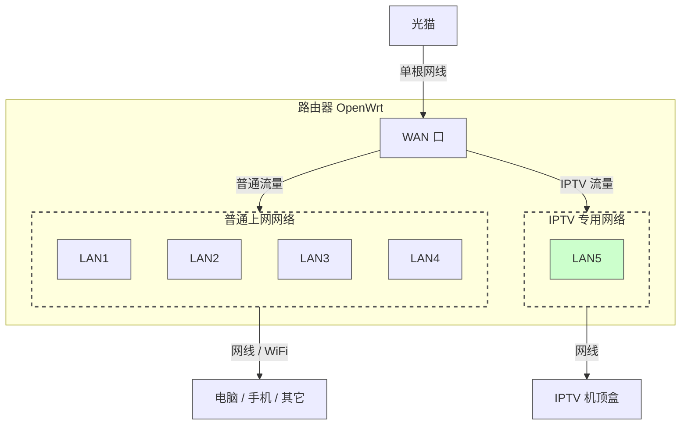
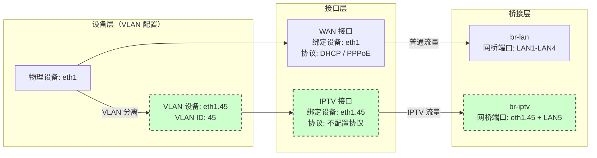

装修时从弱电箱到客厅往往只预留了一根网线。为了同时满足宽带上网和 IPTV 的需求，通常会采用单线复用技术。这避免了重新布线的麻烦，并能充分利用千兆带宽，而不是将网线分芯使用导致速度限制在100M。

单线复用依赖 VLAN（虚拟局域网）技术，它通过标记和分离数据流，让不同业务共用一根物理网线。

本文将介绍如何在 OpenWrt 路由器上，通过规划 LAN 口和配置 VLAN，实现单线复用，让一根网线同时传输上网和 IPTV 信号。

## 一、路由器端口规划

```mermaid
flowchart TB
    subgraph Router[路由器 OpenWrt]
        direction TB
        B[WAN 口]
        subgraph Home_Network[普通上网网络]
            direction TB
            LAN1[LAN1]
            LAN2[LAN2]
            LAN3[LAN3]
            LAN4[LAN4]
        end
        subgraph IPTV_Network[IPTV 专用网络]
            direction TB
            LAN5[LAN5]
        end
    end

    A[光猫] -->|单根网线| B
    B -->|普通流量| Home_Network
    Home_Network -->|网线 / WiFi| H[电脑 / 手机 / 其它]
    B -->|IPTV 流量| IPTV_Network
    IPTV_Network -->|网线| STB[IPTV 机顶盒]

    %% 配色方案
    style A stroke:#555,stroke-width:1px
    style B stroke:#555,stroke-width:1px
    style Home_Network stroke:#555,stroke-width:2px,stroke-dasharray: 5 5
    style IPTV_Network stroke:#555,stroke-width:2px,stroke-dasharray: 5 5
    style H stroke:#555,stroke-width:1px
    style STB stroke:#555,stroke-width:1px
    style LAN1 stroke:#555,stroke-width:1px
    style LAN2 stroke:#555,stroke-width:1px
    style LAN3 stroke:#555,stroke-width:1px
    style LAN4 stroke:#555,stroke-width:1px
    style LAN5 fill:#cfc,stroke:#555,stroke-width:1px
```

如上图所示，将路由器的 LAN 口规划为两个区域：
*   **普通上网区域（LAN1-LAN4）**：连接电脑、手机等设备。
*   **IPTV 专用区域（LAN5）**：专门连接 IPTV 机顶盒。

此规划可隔离两类流量，避免相互干扰。

## 二、网络架构设计

```mermaid
flowchart LR
    %% VLAN 和设备层
    subgraph Device_Layer[设备层（VLAN 配置）]
        direction RL
        eth1[物理设备: eth1]
        eth1_45[VLAN 设备: eth1.45<br>VLAN ID: 45]
        eth1 -->|VLAN 分离| eth1_45
    end

    %% 接口层
    subgraph Interface_Layer[接口层]
        wan_iface[WAN 接口<br>绑定设备: eth1<br>协议: DHCP / PPPoE]
        iptv_iface[IPTV 接口<br>绑定设备: eth1.45<br>协议: 不配置协议]
        eth1 --> wan_iface
        eth1_45 --> iptv_iface
    end

    %% 桥接层
    subgraph Bridge_Layer[桥接层]
        br_lan[br-lan<br>网桥端口: LAN1-LAN4]
        br_iptv[br-iptv<br>网桥端口: eth1.45 + LAN5]
        wan_iface -->|普通流量| br_lan
        iptv_iface -->|IPTV 流量| br_iptv
    end
    
    %% 配色方案
    style br_iptv fill:#cfc,stroke:#555,stroke-width:2px,stroke-dasharray: 5 5
    style iptv_iface fill:#cfc,stroke:#555,stroke-width:2px,stroke-dasharray: 5 5
    style eth1_45 fill:#cfc,stroke:#555,stroke-width:2px,stroke-dasharray: 5 5
```

> 图中绿色标注的部分表示 IPTV 相关的配置项。
{: .prompt-tip }

架构分为三层，以实现逻辑分离：
1.  **设备层**：基于物理设备 `eth1`（WAN口）创建 VLAN 设备 `eth1.45`，分离 IPTV 流量。
2.  **接口层**：
    *   `WAN` 接口：绑定 `eth1`，配置上网协议（DHCP/PPPoE）。
    *   `IPTV` 接口：绑定 `eth1.45`，协议选择“不配置协议”，仅作数据通道。
3.  **桥接层**：
    *   `br-lan`：桥接 `LAN1-LAN4`，处理普通上网数据。
    *   `br-iptv`：桥接 `eth1.45` 和 `LAN5`，专门处理 IPTV 流量。

## 三、前置条件与适用范围

### 适用范围
此方案适用于典型家庭场景：
*   **单线复用需求**：弱电箱到客厅仅有一根网线。
*   **光猫桥接模式**：光猫设为桥接，由 OpenWrt 路由器拨号。
*   **运营商支持**：运营商（如电信、移动、联通）的 IPTV 业务基于 **VLAN** 隔离。

> **不适用的情况**：
> *   需在多个端口同时看 IPTV（需更复杂配置）。
> *   光猫为路由模式，且 IPTV 输出的是**无 VLAN 标签**的流量。
> *   路由器硬件不支持 802.1Q VLAN。

### 前置准备
1.  **路由器要求**：
    *   已刷入 **OpenWrt** 系统的路由器（本文基于 LuCI 界面操作）。
    *   支持 802.1Q VLAN（绝大多数 OpenWrt 设备支持）。
    *   至少 2 个 LAN 口（本文以 1 WAN + 4 LAN 为例）。

2.  **关键信息获取**（**请务必提前确认**）：
    *   **IPTV VLAN ID**：这是核心参数。示例值 `45` 是电信常见 ID，**不同运营商、地区可能完全不同**。请从光猫配置、装机师傅或运营商处获取。
    *   **接口名称**：登录 OpenWrt，进入“网络” -> “接口”，确认 WAN 口设备名（通常是 `eth1` 或 `wan`）及 LAN 口设备名（如 `lan1`, `lan2`, `lan5`）。您的接口名可能与示例不同。

3.  **网络连接安全**：
    *   **备份配置**：开始前，前往“系统 -> 备份/升级 -> 生成备份”。
    *   **使用 Wi-Fi 管理**：配置过程中，建议通过 Wi-Fi 连接路由器，以防有线连接因配置错误中断。

## 四、配置步骤

### 步骤1：创建 VLAN 设备

在“网络” -> “设备”页面，点击“添加新设备...”。
*   **设备类型**：选择 `VLAN(802.1q)`。
*   **基础设备**：选择 `eth1`（请按您路由器上的实际 WAN 口设备名选择）。
*   **VLAN ID**：输入您获取到的实际 IPTV VLAN ID（示例为 `45`）。

> **重要**：`45` 是示例值，**必须替换为您从运营商处获取的实际 VLAN ID**。
{: .prompt-warning }

设备名会自动生成（如 `eth1.45`）。保存后，在设备列表中应能看到它。

{: .shadow}

### 步骤2：创建网桥设备

仍在“设备”页面，点击“添加新设备...”。
*   **设备类型**：选择 `网桥设备`。
*   **设备名称**：输入 `br-iptv`。
*   **网桥端口**：勾选上一步创建的 `eth1.45` 和您计划用于 IPTV 的物理 LAN 口（例如 `lan5`）。

保存配置。

{: .shadow}

### 步骤3：创建 IPTV 接口

进入“网络” -> “接口”，点击“添加新接口...”。
*   **名称**：可输入 `IPTV`。
*   **协议**：选择 `不配置协议`（表示此接口仅进行二层透传，不处理三层路由）。
*   **设备**：选择刚创建的 `br-iptv`。

保存配置，无需设置防火墙区域。

{: .shadow}

### 步骤4：调整原有 br-lan 网桥
在“设备”页面，找到并编辑原有的 `br-lan` 设备。
*   在“网桥端口”中，**取消勾选**您分配给 IPTV 的那个物理端口（例如 `LAN5`）。
*   此举是为了将该端口从普通上网网络中移除，避免广播干扰。

保存配置。

{: .shadow}

### 步骤5：应用配置并重启
点击页面下方的“保存并应用”。根据提示，**重启路由器**使所有配置生效。

## 五、验证与测试
重启后，请按以下步骤验证：

1.  **普通上网验证**：
    *   将电脑连接到非 IPTV 专用口（如 `LAN1-LAN4`）或路由器 Wi-Fi。
    *   尝试浏览网页或测速，确认上网正常。

2.  **IPTV 业务验证**：
    *   将 IPTV 机顶盒连接到专用口（如 `LAN5`）。
    *   开机，观察机顶盒是否能正常启动并获取 IP 地址。
    *   尝试播放直播电视频道，特别是高清频道。

3.  **同步运行测试**：
    *   在电脑上进行大流量下载（如测速）的同时，观察 IPTV 直播是否流畅。无卡顿则说明隔离成功。

## 六、排障与风险提示

### 常见问题排查
*   **完全无法上网**：
    *   检查 WAN 口连接和拨号设置（PPPoE账号密码）是否被意外更改。
    *   通过 Wi-Fi 登录，检查“网络”->“接口”中 WAN 口是否获取到 IP。
*   **IPTV 机顶盒无法连接**：
    *   **最常见原因**：VLAN ID 错误。请反复核对输入的 VLAN ID 是否与运营商提供的一致。
    *   检查机顶盒所连端口是否与 `br-iptv` 网桥中绑定的端口一致。
    *   确认光猫侧的 IPTV VLAN 绑定配置正常（通常装机时已设好）。
*   **配置后无法访问路由器管理界面**：
    *   如果您之前通过 `LAN5` 口有线管理，配置后该口已专用于 IPTV，自然会失联。
    *   **解决方法**：改用其他 LAN 口（`LAN1-LAN4`）或 Wi-Fi 连接进行管理。

### 风险提示与回滚
*   **配置风险**：错误的 VLAN 或桥接配置可能导致网络端口异常或暂时失联。
*   **安全措施**：
    *   务必在开始前**备份配置**。
    *   配置过程中，**优先使用 Wi-Fi 进行管理**。
*   **回滚方法**：
    *   若配置错误但仍可访问（通过 Wi-Fi 或其他 LAN 口），可登录 LuCI 逐一修正。
    *   若完全无法访问，可使用路由器的物理复位按钮进入故障安全模式，或重置后恢复备份的配置文件。

## 七、常见问题（FAQ）

### 1. 为什么需要重启路由器？
因为 OpenWrt 的接口、VLAN 和桥接配置需重启网络服务或路由器才能完全生效。应用更改后重启是最稳妥的方式。

### 2. 在光猫路由模式下，路由器刷了 OpenWrt 为什么能直接上网？
在 OpenWrt 中，WAN 口（`eth1`）的流量通过路由（三层）转发到 `br-lan`，而非桥接（二层）。因此默认 `eth1` 不加入任何网桥也能上网。

### 3. 光猫如何改桥接模式？
目前许多电信光猫默认已包含桥接和路由连接。通常只需将路由器 WAN 接口协议改为 PPPoE，并填入宽带账号密码即可。
*   `2_INTERNET_B_VID_`：`B` 表示 Bridge（桥接）。
*   `5_INTERNET_R_VID_`：`R` 表示 Route（路由）。

### 4. 改桥接后，如何访问光猫管理界面？
*   **方法1（推荐）**：在 OpenWrt 创建一个新接口（如取名 `modem`），协议选 DHCP 客户端，设备选 `eth1`（WAN口物理设备）。保存后即可通过光猫 IP（如 `192.168.1.1`）访问。
*   **方法2**：用另一根网线连接路由器 LAN 口和光猫 LAN 口（受限于单线条件，通常不适用）。
*   **方法3**：临时用电脑直接连接光猫 LAN 口进行访问。
